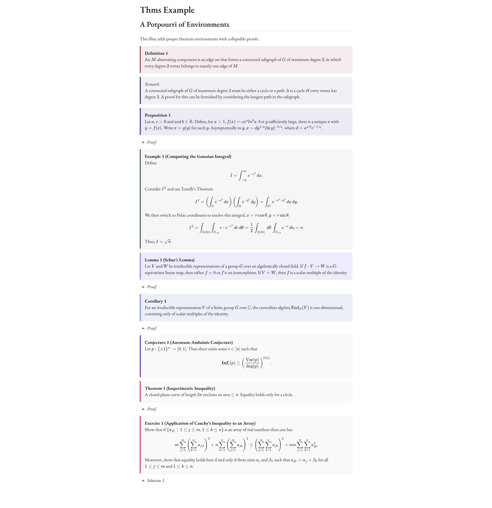

# thms for quarto

Cleanly formatted theorem environments for the web.

## installing

```bash
quarto add barrel111/thms
```

This will install the extension under the `_extensions` subdirectory. If you're using version control, you will want to check in this directory.

## using

The extension uses the theorem and proof divs that Quarto already provides. The extension provides a theme for all the environments as well as support for collapsible proof (and solution) environments. For the page to remember which proof was collapsed by the user between multiple visits, we need to store some state locally for each proof. Quarto proofs are implemented using a class and the fenced divs break when an additional id is provided. So, for this functionality to work one should label the proof with a key attribute.

```md
::: {.proof key=thmproof}
:::
```

## example

Here is the source code for a minimal example: [example.qmd](example.qmd).

The example page is rendered as follows.


